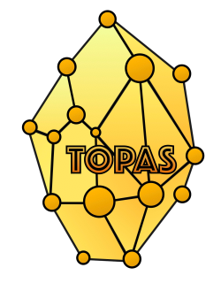

<p align="center">
  
</p>

TOPAS (TOP-down Attachment of Seeds) is an iterative approach which aims at connecting the largest number of seed nodes in a top-down fashion through connectors which guarantee the highest flow of a Random Walk with Restart in a network of functional associations.

* Version 1.0

### Step 1: Installation

TOPAS is implemented in R (≥4.1), and it was tested in a version-controlled conda environment. 

Clone the TOPAS repository and follow the instructions to install [Miniconda](https://docs.conda.io/en/latest/miniconda.html) and then execute the following to generate a conda environment with all you need to run TOPAS:
```
conda env create -f environment.yml
```

### Step 2: Program Execution

Once you have created a new conda environment, make sure to activate it before running TOPAS. 
```
conda activate topas
```

You can copy this R snippet into your local computer to produce a disease module as an example. You may want to set the path to match the working directory where you cloned the TOPAS repository.

```{r}
#!/usr/bin/Rscript

setwd('~/topas') 
source('src/TOPAS.R')

## Load network
network_example = 
  readr::read_tsv(file = 'example/FunCoup5_pfc80.tsv.gz', 
                  col_names = c('V1','V2'), 
                  col_types = 'cc')
## Seed gene set
seeds_example = 
  readr::read_table(file = 'example/adrenal_gland_diseases.txt', 
                    col_names = 'V',
                    col_types = 'c')

module_example = 
  TOPAS(
    network = network_example,
    seeds = seeds_example$V,
    expansion_steps = 2,
    cores = 4
    )

readr::write_tsv(module_example, file = 'example/TOPAS_adrenal_gland_diseases.tsv')
```

*NOTE*: TOPAS is only designed to process undirected networks!


### Contacts ###

* Davide Buzzao (davide.buzzao@scilifelab.se)
* Erik L.L. Sonnhammer (erik.sonnhammer@scilifelab.se)